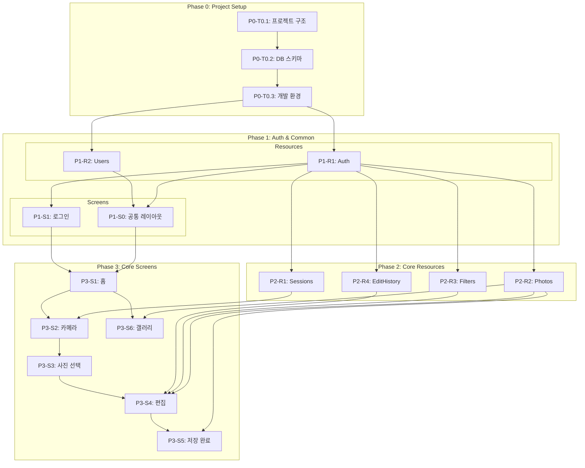

# Story Lens - TASKS.md

> Domain-Guarded Task Structure v2.0
> "화면이 주도하되, 도메인이 방어한다"

---

## 의존성 그래프

---

## Phase 0: Project Setup

### [x] P0-T0.1: 프로젝트 구조 초기화
- **담당**: frontend-specialist
- **스펙**: React+Vite 프론트엔드 + FastAPI 백엔드 프로젝트 구조 생성
- **파일**:
  - `frontend/package.json`
  - `frontend/vite.config.ts`
  - `frontend/tsconfig.json`
  - `frontend/src/App.tsx`
  - `frontend/src/main.tsx`
  - `backend/app/main.py`
  - `backend/requirements.txt`
  - `backend/app/config.py`
- **세부**:
  - React 19 + Vite 6 + TypeScript
  - FastAPI + Python 3.11+
  - Zustand (상태관리)
  - React Router (라우팅)
  - Pretendard 폰트 설정
  - 디자인 토큰 CSS 변수 (`05-design-system.md` 기반)

### [x] P0-T0.2: DB 스키마 및 마이그레이션
- **담당**: database-specialist
- **스펙**: PostgreSQL 스키마 생성 (Alembic 마이그레이션)
- **파일**: `backend/alembic/versions/001_initial_schema.py` → `backend/app/models/`
- **세부**:
  - users 테이블 (id, name, email, password_hash, role, teacher_id, is_active)
  - sessions 테이블 (id, user_id, location, date, title)
  - photos 테이블 (id, user_id, session_id, original_url, edited_url, title, thumbnail_url)
  - edit_history 테이블 (id, photo_id, filter_name, adjustments JSONB, crop_data JSONB)
  - 인덱스 생성 (`04-database-design.md` 참조)
  - 시드 데이터: 선생님 1명, 학생 3명 테스트 계정

### [x] P0-T0.3: 개발 환경 설정
- **담당**: backend-specialist
- **스펙**: Docker Compose + 환경변수 설정
- **파일**:
  - `docker-compose.yml`
  - `.env.example`
  - `backend/Dockerfile`
  - `frontend/Dockerfile`
- **세부**:
  - PostgreSQL 15 컨테이너
  - FastAPI 개발 서버 (hot reload)
  - Vite 개발 서버 (HMR)
  - CORS 설정 (localhost:5173 → localhost:8000)

---

## Phase 1: Auth & Common

### P1-R1: Auth Resource

#### [ ] P1-R1-T1: Auth API 구현
- **담당**: backend-specialist
- **리소스**: auth
- **엔드포인트**:
  - POST /api/auth/login (로그인)
  - POST /api/auth/logout (로그아웃)
  - POST /api/auth/refresh (토큰 갱신)
- **필드**: access_token, refresh_token, user
- **파일**: `backend/tests/api/test_auth.py` → `backend/app/routes/auth.py`
- **스펙**: JWT 기반 인증 (access 15분, refresh 7일), bcrypt 패스워드 해싱
- **Worktree**: `worktree/phase-1-auth`
- **TDD**: RED → GREEN → REFACTOR
- **병렬**: P1-R2-T1과 병렬 가능

### P1-R2: Users Resource

#### [ ] P1-R2-T1: Users API 구현
- **담당**: backend-specialist
- **리소스**: users
- **엔드포인트**:
  - GET /api/users/me (현재 사용자 정보)
  - POST /api/users (학생 계정 생성 - 선생님만)
  - GET /api/users (학생 목록 조회 - 선생님만)
- **필드**: id, name, email, role, teacher_id, is_active, created_at
- **파일**: `backend/tests/api/test_users.py` → `backend/app/routes/users.py`
- **스펙**: 역할 기반 접근 제어 (teacher: 전체, student: 본인만)
- **Worktree**: `worktree/phase-1-auth`
- **TDD**: RED → GREEN → REFACTOR
- **병렬**: P1-R1-T1과 병렬 가능

---

### P1-S0: 공통 레이아웃

#### [ ] P1-S0-T1: 공통 레이아웃 및 라우팅 구현
- **담당**: frontend-specialist
- **컴포넌트**:
  - AuthGuard (인증 체크, 미인증 시 /login 리다이렉트)
  - PageHeader (뒤로가기 + 제목 + 액션)
  - LoadingSpinner
  - ErrorToast / SuccessToast
  - ConfirmModal
  - PrimaryButton / SecondaryButton
- **데이터 요구**: auth (token 관리), users (현재 사용자)
- **파일**: `frontend/tests/components/AuthGuard.test.tsx` → `frontend/src/components/common/`
- **스펙**: Zustand auth store, axios interceptor (JWT 자동 첨부/갱신), React Router 라우팅
- **Worktree**: `worktree/phase-1-common`
- **TDD**: RED → GREEN → REFACTOR
- **데모**: `/demo/phase-1/s0-common-layout`
- **데모 상태**: loading, error, authenticated, unauthenticated
- **의존**: P1-R1-T1, P1-R2-T1

### P1-S1: 로그인 화면

#### [ ] P1-S1-T1: 로그인 UI 구현
- **담당**: frontend-specialist
- **화면**: /login
- **컴포넌트**:
  - AppLogo (이미지)
  - LoginForm (이메일 + 비밀번호 + 로그인 버튼)
- **데이터 요구**: auth (login API)
- **파일**: `frontend/tests/pages/Login.test.tsx` → `frontend/src/pages/login/index.tsx`
- **스펙**: 로그인 폼, 에러 메시지, 빈 필드 검증, 로그인 성공 시 / 이동
- **Worktree**: `worktree/phase-1-common`
- **TDD**: RED → GREEN → REFACTOR
- **데모**: `/demo/phase-1/s1-login`
- **데모 상태**: loading, error, success
- **의존**: P1-S0-T1

#### [ ] P1-S1-T2: 로그인 통합 테스트
- **담당**: test-specialist
- **화면**: /login
- **시나리오**:
  | 이름 | When | Then |
  |------|------|------|
  | 로그인 성공 | 올바른 이메일/비밀번호 → 로그인 클릭 | / 이동, JWT 저장 |
  | 로그인 실패 | 잘못된 비밀번호 → 로그인 클릭 | 에러 메시지 표시 |
  | 빈 필드 | 미입력 → 로그인 클릭 | 필수 입력 안내 |
- **파일**: `frontend/tests/e2e/login.spec.ts`
- **Worktree**: `worktree/phase-1-common`

#### [ ] P1-S1-V: 로그인 연결점 검증
- **담당**: test-specialist
- **화면**: /login
- **검증 항목**:
  - [ ] Field Coverage: auth.[access_token, refresh_token, user] 존재
  - [ ] Endpoint: POST /api/auth/login 응답 정상
  - [ ] Navigation: LoginForm 성공 → / 라우트 존재
  - [ ] Auth: 로그인 후 토큰이 저장되어 이후 요청에 포함됨
- **파일**: `frontend/tests/integration/login.verify.ts`

---

## Phase 2: Core Resources (Backend)

### P2-R1: Sessions Resource

#### [ ] P2-R1-T1: Sessions API 구현
- **담당**: backend-specialist
- **리소스**: sessions
- **엔드포인트**:
  - POST /api/sessions (새 촬영 세션 생성)
  - GET /api/sessions (세션 목록 조회)
- **필드**: id, user_id, location, date, title, created_at
- **파일**: `backend/tests/api/test_sessions.py` → `backend/app/routes/sessions.py`
- **스펙**: 촬영 세션 생성 (카메라 시작 시), 목록 조회
- **Worktree**: `worktree/phase-2-resources`
- **TDD**: RED → GREEN → REFACTOR
- **병렬**: P2-R2-T1, P2-R3-T1, P2-R4-T1과 병렬 가능
- **의존**: P1-R1-T1

### P2-R2: Photos Resource

#### [ ] P2-R2-T1: Photos API 구현
- **담당**: backend-specialist
- **리소스**: photos
- **엔드포인트**:
  - GET /api/photos (사진 목록 - 갤러리용)
  - GET /api/photos/:id (사진 상세)
  - POST /api/photos (사진 업로드)
  - PUT /api/photos/:id (사진 수정 - 편집 결과 저장)
  - DELETE /api/photos/:id (사진 삭제)
- **필드**: id, user_id, session_id, original_url, edited_url, title, thumbnail_url, created_at, updated_at
- **파일**: `backend/tests/api/test_photos.py` → `backend/app/routes/photos.py`
- **스펙**: 사진 CRUD + 파일 업로드 (multipart/form-data), 썸네일 자동 생성, 사용자 본인 사진만 접근
- **Worktree**: `worktree/phase-2-resources`
- **TDD**: RED → GREEN → REFACTOR
- **병렬**: P2-R1-T1, P2-R3-T1, P2-R4-T1과 병렬 가능
- **의존**: P1-R1-T1

### P2-R3: Filters Resource

#### [ ] P2-R3-T1: Filters API 구현
- **담당**: backend-specialist
- **리소스**: filters
- **엔드포인트**:
  - GET /api/filters (필터 프리셋 목록)
- **필드**: id, name, label, css_filter, preview_url
- **파일**: `backend/tests/api/test_filters.py` → `backend/app/routes/filters.py`
- **스펙**: 5개 느낌 기반 필터 (따뜻한, 시원한, 행복한, 차분한, 회상) 시드 + 조회
- **Worktree**: `worktree/phase-2-resources`
- **TDD**: RED → GREEN → REFACTOR
- **병렬**: P2-R1-T1, P2-R2-T1, P2-R4-T1과 병렬 가능
- **의존**: P1-R1-T1

### P2-R4: EditHistory Resource

#### [ ] P2-R4-T1: EditHistory API 구현
- **담당**: backend-specialist
- **리소스**: edit_history
- **엔드포인트**:
  - GET /api/photos/:photoId/edits (편집 이력 조회)
  - POST /api/photos/:photoId/edits (편집 저장)
- **필드**: id, photo_id, filter_name, adjustments (JSONB), crop_data (JSONB), created_at
- **파일**: `backend/tests/api/test_edit_history.py` → `backend/app/routes/edit_history.py`
- **스펙**: 편집 이력 저장 (필터+조정값+크롭 데이터), 최신 이력 조회
- **Worktree**: `worktree/phase-2-resources`
- **TDD**: RED → GREEN → REFACTOR
- **병렬**: P2-R1-T1, P2-R2-T1, P2-R3-T1과 병렬 가능
- **의존**: P1-R1-T1

---

## Phase 3: Core Screens (Frontend)

### P3-S1: 홈 화면

#### [ ] P3-S1-T1: 홈 UI 구현
- **담당**: frontend-specialist
- **화면**: /
- **컴포넌트**:
  - Greeting (사용자 이름 인사말)
  - TakePhotoButton (사진 찍기 메인 CTA)
  - MyPhotosButton (내 사진 보기)
  - LogoutButton (로그아웃)
- **데이터 요구**: users (name, role)
- **파일**: `frontend/tests/pages/Home.test.tsx` → `frontend/src/pages/home/index.tsx`
- **스펙**: 큰 사진 찍기 버튼 중앙, 인사말, 로그아웃
- **Worktree**: `worktree/phase-3-screens`
- **TDD**: RED → GREEN → REFACTOR
- **데모**: `/demo/phase-3/s1-home`
- **데모 상태**: loading, normal
- **의존**: P1-S0-T1, P1-S1-T1

#### [ ] P3-S1-V: 홈 연결점 검증
- **담당**: test-specialist
- **화면**: /
- **검증 항목**:
  - [ ] Field Coverage: users.[name, role] 존재
  - [ ] Endpoint: GET /api/users/me 응답 정상
  - [ ] Navigation: TakePhotoButton → /camera 라우트 존재
  - [ ] Navigation: MyPhotosButton → /gallery 라우트 존재
  - [ ] Navigation: LogoutButton → /login 라우트 존재
  - [ ] Auth: 미인증 시 /login 리다이렉트
- **파일**: `frontend/tests/integration/home.verify.ts`

---

### P3-S2: 카메라 화면

#### [ ] P3-S2-T1: 카메라 UI 구현
- **담당**: frontend-specialist
- **화면**: /camera
- **컴포넌트**:
  - CameraViewfinder (WebRTC 실시간 프리뷰)
  - CaptureButton (촬영 버튼 - 원형, 하단 중앙)
  - PhotoCounter (촬영 수 표시)
  - FinishButton (찍기 끝)
- **데이터 요구**: sessions (세션 생성)
- **파일**: `frontend/tests/pages/Camera.test.tsx` → `frontend/src/pages/camera/index.tsx`
- **스펙**: WebRTC MediaDevices API 카메라 프리뷰, 사진 캡처→메모리 저장, 권한 요청 처리
- **Worktree**: `worktree/phase-3-screens`
- **TDD**: RED → GREEN → REFACTOR
- **데모**: `/demo/phase-3/s2-camera`
- **데모 상태**: loading, permission-denied, capturing, captured
- **의존**: P3-S1-T1, P2-R1-T1

#### [ ] P3-S2-V: 카메라 연결점 검증
- **담당**: test-specialist
- **화면**: /camera
- **검증 항목**:
  - [ ] Endpoint: POST /api/sessions 응답 정상
  - [ ] Navigation: FinishButton → /select 라우트 존재
  - [ ] Auth: 미인증 시 /login 리다이렉트
  - [ ] Permission: 카메라 권한 거부 시 에러 UI 표시
- **파일**: `frontend/tests/integration/camera.verify.ts`

---

### P3-S3: 사진 선택 화면

#### [ ] P3-S3-T1: 사진 선택 UI 구현
- **담당**: frontend-specialist
- **화면**: /select
- **컴포넌트**:
  - PhotoPreview (큰 사진 캐러셀 - 스와이프)
  - PhotoIndicator (1/5 번호 표시)
  - EditButton (이 사진 편집하기 CTA)
  - RetakeButton (다시 찍기)
- **데이터 요구**: 없음 (브라우저 메모리에서 전달)
- **파일**: `frontend/tests/pages/Select.test.tsx` → `frontend/src/pages/select/index.tsx`
- **스펙**: 촬영된 사진 스와이프 탐색, 선택 시 서버 업로드 후 편집 화면 이동
- **Worktree**: `worktree/phase-3-screens`
- **TDD**: RED → GREEN → REFACTOR
- **데모**: `/demo/phase-3/s3-select`
- **데모 상태**: single-photo, multiple-photos
- **의존**: P3-S2-T1

#### [ ] P3-S3-V: 사진 선택 연결점 검증
- **담당**: test-specialist
- **화면**: /select
- **검증 항목**:
  - [ ] Endpoint: POST /api/photos 업로드 정상
  - [ ] Navigation: EditButton → /edit/:photoId 라우트 존재
  - [ ] Navigation: RetakeButton → /camera 라우트 존재
  - [ ] Auth: 미인증 시 /login 리다이렉트
- **파일**: `frontend/tests/integration/select.verify.ts`

---

### P3-S4: 편집 화면

#### [ ] P3-S4-T1: 편집 UI 구현
- **담당**: frontend-specialist
- **화면**: /edit/:photoId
- **컴포넌트**:
  - PhotoCanvas (Canvas API 편집 미리보기)
  - EditorTabs (필터/조절/자르기 3탭)
  - FilterPanel (느낌 필터 카드 그리드)
  - AdjustmentPanel (슬라이더 5개: 밝기/채도/대비/온도/선명도)
  - CropPanel (자르기 영역 + 회전 + 뒤집기)
  - SaveButton (저장)
  - BackButton (뒤로가기)
- **데이터 요구**: photos (원본), filters (필터 목록), edit_history (이전 편집)
- **파일**: `frontend/tests/pages/Editor.test.tsx` → `frontend/src/pages/editor/index.tsx`
- **스펙**: Canvas API 실시간 필터/조정/크롭, 슬라이더 -50~+50, 필터 카드 120x120px, 저장 시 편집 결과 서버 전송
- **Worktree**: `worktree/phase-3-screens`
- **TDD**: RED → GREEN → REFACTOR
- **데모**: `/demo/phase-3/s4-editor`
- **데모 상태**: loading, filter-tab, adjustment-tab, crop-tab, saving
- **의존**: P3-S3-T1, P2-R2-T1, P2-R3-T1, P2-R4-T1

#### [ ] P3-S4-T2: 편집 통합 테스트
- **담당**: test-specialist
- **화면**: /edit/:photoId
- **시나리오**:
  | 이름 | When | Then |
  |------|------|------|
  | 초기 로드 | 편집 화면 접속 | 원본 사진 표시, 필터 탭 활성 |
  | 필터 적용 | 따뜻한 필터 클릭 | 사진 실시간 변경, 카드 강조 |
  | 슬라이더 조절 | 밝기 +30 드래그 | 사진 밝기 변경, 수치 표시 |
  | 탭 전환 | 자르기 탭 클릭 | 자르기 도구 표시 |
  | 저장 | 저장 버튼 클릭 | 서버 저장, /saved 이동 |
- **파일**: `frontend/tests/e2e/editor.spec.ts`
- **Worktree**: `worktree/phase-3-screens`

#### [ ] P3-S4-V: 편집 연결점 검증
- **담당**: test-specialist
- **화면**: /edit/:photoId
- **검증 항목**:
  - [ ] Field Coverage: photos.[id, original_url, edited_url] 존재
  - [ ] Field Coverage: filters.[id, name, label, css_filter] 존재
  - [ ] Field Coverage: edit_history.[filter_name, adjustments, crop_data] 존재
  - [ ] Endpoint: GET /api/photos/:id 응답 정상
  - [ ] Endpoint: GET /api/filters 응답 정상
  - [ ] Endpoint: POST /api/photos/:photoId/edits 저장 정상
  - [ ] Endpoint: PUT /api/photos/:id 편집 결과 저장 정상
  - [ ] Navigation: SaveButton → /saved 라우트 존재
  - [ ] Auth: 미인증 시 /login 리다이렉트
- **파일**: `frontend/tests/integration/editor.verify.ts`

---

### P3-S5: 저장 완료 화면

#### [ ] P3-S5-T1: 저장 완료 UI 구현
- **담당**: frontend-specialist
- **화면**: /saved
- **컴포넌트**:
  - SuccessMessage (저장 완료! 텍스트)
  - PhotoPreview (편집된 사진 미리보기)
  - HomeButton (홈으로)
  - ReEditButton (다시 편집)
- **데이터 요구**: photos (edited_url)
- **파일**: `frontend/tests/pages/Saved.test.tsx` → `frontend/src/pages/saved/index.tsx`
- **스펙**: 저장 완료 메시지, 편집된 사진 크게 보기, 홈/재편집 버튼
- **Worktree**: `worktree/phase-3-screens`
- **TDD**: RED → GREEN → REFACTOR
- **데모**: `/demo/phase-3/s5-saved`
- **데모 상태**: normal
- **의존**: P3-S4-T1, P2-R2-T1

#### [ ] P3-S5-V: 저장 완료 연결점 검증
- **담당**: test-specialist
- **화면**: /saved
- **검증 항목**:
  - [ ] Field Coverage: photos.[id, edited_url] 존재
  - [ ] Navigation: HomeButton → / 라우트 존재
  - [ ] Navigation: ReEditButton → /edit/:photoId 라우트 존재
- **파일**: `frontend/tests/integration/saved.verify.ts`

---

### P3-S6: 사진 목록 (갤러리) 화면

#### [ ] P3-S6-T1: 갤러리 UI 구현
- **담당**: frontend-specialist
- **화면**: /gallery
- **컴포넌트**:
  - BackButton (뒤로가기 → 홈)
  - PhotoGrid (격자 갤러리 2~3열)
  - EmptyState (사진 없을 때 안내)
- **데이터 요구**: photos (id, thumbnail_url, edited_url, created_at)
- **파일**: `frontend/tests/pages/Gallery.test.tsx` → `frontend/src/pages/gallery/index.tsx`
- **스펙**: 사진 격자 표시 (모바일 2열, 태블릿 3열), 1:1 썸네일, 사진 클릭 시 편집 이동, 빈 상태 처리
- **Worktree**: `worktree/phase-3-screens`
- **TDD**: RED → GREEN → REFACTOR
- **데모**: `/demo/phase-3/s6-gallery`
- **데모 상태**: loading, empty, normal
- **의존**: P3-S1-T1, P2-R2-T1

#### [ ] P3-S6-V: 갤러리 연결점 검증
- **담당**: test-specialist
- **화면**: /gallery
- **검증 항목**:
  - [ ] Field Coverage: photos.[id, thumbnail_url, edited_url, created_at] 존재
  - [ ] Endpoint: GET /api/photos 응답 정상
  - [ ] Navigation: PhotoGrid 클릭 → /edit/:photoId 라우트 존재
  - [ ] Navigation: BackButton → / 라우트 존재
  - [ ] Auth: 미인증 시 /login 리다이렉트
- **파일**: `frontend/tests/integration/gallery.verify.ts`

---

## Phase 3 연결점 검증 요약

### [ ] P3-V: Phase 3 연결점 검증 요약
- **담당**: test-specialist
- **범위**: P3의 모든 화면
- **검증 요약**:
  | 화면 | API | Navigation | Auth | 공통 컴포넌트 |
  |------|-----|-----------|------|-------------|
  | 홈 | 1 | 3 | 1 | AuthGuard |
  | 카메라 | 1 | 1 | 1 | AuthGuard |
  | 사진 선택 | 1 | 2 | 1 | AuthGuard |
  | 편집 | 4 | 1 | 1 | AuthGuard |
  | 저장 완료 | 0 | 2 | 0 | - |
  | 갤러리 | 1 | 2 | 1 | AuthGuard |
- **전체 통과 조건**: 모든 항목 ✅

---

## 태스크 요약

| Phase | Resource | Screen | Verification | Total |
|-------|----------|--------|-------------|-------|
| P0 | - | - | - | 3 |
| P1 | 2 | 2 (UI) + 1 (Test) | 1 | 6 |
| P2 | 4 | - | - | 4 |
| P3 | - | 7 (UI) + 1 (Test) | 7 | 15 |
| **Total** | **6** | **11** | **8** | **28** |

## 병렬 실행 가이드

| 그룹 | 태스크 | 병렬? |
|------|--------|------|
| P0 | P0-T0.1 → P0-T0.2 → P0-T0.3 | 순차 |
| P1 Resources | P1-R1-T1, P1-R2-T1 | ✅ 병렬 |
| P1 Screens | P1-S0-T1 → P1-S1-T1 → P1-S1-T2 | 순차 |
| P2 Resources | P2-R1-T1, P2-R2-T1, P2-R3-T1, P2-R4-T1 | ✅ 병렬 |
| P3 Screens | S1→S2→S3→S4→S5, S1→S6 | S6는 S1 이후 병렬 가능 |
